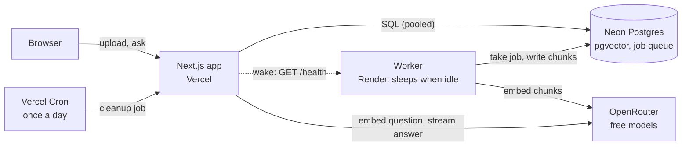

# AskDocs

[](https://github.com/rohanahmed24/askdocs/actions/workflows/ci.yml)

Multi-tenant document Q&A. Upload txt, md or pdf files to an organization, then ask questions and get answers with a citation to the exact passage each claim came from. If the documents do not answer the question, it says so instead of guessing.

**Live demo:** https://askdocs-rho.vercel.app. Create an account, upload a few files from [`eval/corpus`](eval/corpus) (made-up company documents, English and Bengali), and ask something like "How long do I have to pay an invoice before a penalty is added?" or "What does error code E-4021 mean?". The first upload after the app has been idle can wait two to three minutes in `queued`, because the worker runs on a free plan that sleeps (see [Hosting](#hosting)).

Design: [Figma file with phone and desktop screens](https://www.figma.com/design/nkCD0lJe2HNa18pMurSCuM).

## How it works



**Upload.** The route checks the file, reserves storage on the organization row (`SELECT ... FOR UPDATE`, so two uploads cannot both squeeze under the limit), stores the file in Postgres and queues a job. It does not wait for indexing.

**Index.** The worker is a separate process. It takes the job (pg-boss, stored in the same Postgres), extracts the text (unpdf for PDFs), splits it into overlapping chunks that never break inside a character, embeds them with a free OpenRouter model and saves 2048-dimension `halfvec` vectors under an HNSW index. A job can run twice without duplicating chunks, and failures retry with backoff; a failed document shows a retry button.

**Ask.** The question is embedded (a repeated question reuses the saved vector), the six closest passages of this organization above a similarity of 0.25 are found, and a free chat model answers from those passages only, with `[n]` citations, streamed as it is written. An answer that cites no real passage is replaced by "I could not find that in your documents." When no passage is close enough the model is not called at all. Details: [`docs/decisions.md`](docs/decisions.md) #23.

**Tenant isolation.** Every read and write of tenant data goes through `getOrgScope` ([`src/server/org-scope.ts`](src/server/org-scope.ts)), which first checks membership in the database and then puts `org_id = ...` inside every query, including the vector search. A route cannot forget the filter because it never writes one. A browser test with two organizations checks that one sees and gets nothing of the other's documents, and it was verified by removing the filter on purpose (the test failed).

## Search quality

`pnpm eval` measures retrieval on 8 documents and 14 questions (paraphrases, exact ids, numbers, Bengali, cross-language). First-place hits:

| Method | hit@1 | MRR |
| --- | --- | --- |
| Meaning only (embeddings) | 13 / 14 | 0.964 |
| Meaning plus keywords on every word | 12 / 14 | 0.901 |
| Meaning plus keywords on ids and numbers only (used) | 14 / 14 | 1.000 |

Keyword search on every word made results worse, so keywords are limited to identifiers and numbers. The set is small and the last change was designed around the failing questions; [`docs/evaluation.md`](docs/evaluation.md) says what the numbers do not show, and how the "found nothing" threshold was chosen.

## Key decisions and trade-offs

The full list, with reasons, is in [`docs/decisions.md`](docs/decisions.md). The ones a reader will ask about:

| Decision | Trade-off |
| --- | --- |
| Free hosting and free AI models only (#18, #19, #20, #26) | The worker sleeps after 15 minutes idle and the web app wakes it, so the first document after a pause waits two to three minutes. Free embedding models allow 50 requests a day, so the app saves question vectors and counts questions per user (20 an hour). |
| Separate worker process with a Postgres queue (#6, #12, #14) | One more thing to deploy, but uploads return at once, work retries, and a web outage never loses a job. |
| Files and vectors in Postgres (#11, #21) | One database to run, back up and isolate by `org_id`, at the cost of not scaling to very large files. Uploads are limited to 4 MB because of Vercel's request body limit (#15). |
| Hybrid search for ids and numbers only (#24) | Measured, not assumed: all-word keyword search lost to meaning alone. |
| Polling, not streaming, for document status (#22) | A 3 second delay in the list, but it works on serverless without a long-lived connection. |
| Tests run against a real Postgres, browser tests use a stand-in AI service (#25) | Tests cost no free requests and give the same result every time; they do not judge the quality of real answers (the evaluation and manual checks do). |

## What I would build next

- Invite members and switch between organizations (today one account has one organization, decision #10).
- A larger evaluation set with real documents, and a check of the answers themselves, not only the search.
- An always-on worker, which removes the first-upload wait (nothing in the code changes except the wake-up ping).
- Row-level security in Postgres as a second layer under `getOrgScope`, and an invite code or daily caps on sign-up and AI use (`docs/decisions.md` #26 lists the known risk).

## How I used AI

I built this with Claude Code (Anthropic's coding agent), and I want to be exact about who did what.

- **Claude wrote the code, the tests and the docs.** That includes the three pieces that matter most for correctness: the organization scope (`src/server/org-scope.ts`), the storage quota with its row lock (`src/server/quota.ts`) and the text chunker (`src/chunker`). I first planned to write those three by hand, then asked Claude to write them. `docs/decisions.md` #16 records that change.
- **I set the goal, the scope and the design direction**, and approved each step: a multi-tenant document Q&A app for a full-stack role, the Rohan.A design system for the UI, the order of work (auth, ingestion, then chat, then deploy), and what to cut.
- **What I did myself.** I chose to use free hosting and free AI models only, so the demo costs nothing to run. I created the Vercel, Render and Neon projects and pasted the settings into their dashboards by hand, so no key or password went through a script. I wrote to GitHub Support to get Actions unlocked on my account (the cause was an old failed payment, and it needed no card). I am a front-end developer (Framer, Webflow, React) moving to full-stack, so the backend parts are where I am still learning: I read `docs/walkthrough.md` and I am working through a quiz on the three key pieces, and I will not claim more than I can explain.
- **How the code is checked:** tests run against a real Postgres, and the risky ones were checked by breaking the code on purpose. Removing `FOR UPDATE` from the quota makes the lock test fail. Removing the grapheme check from the chunker makes the emoji and Bengali tests fail. Removing the organization filter from the search makes the isolation test fail. `docs/walkthrough.md` explains why each of the three pieces is built the way it is.
- **Verified with the real services:** embeddings and chat with free OpenRouter models, in English and Bengali (`pnpm smoke:embeddings`, `pnpm eval`), and the deployed app (sign-up, upload and indexing by the worker on Render, a cited answer, the no-answer sentence and an exact-id question). The first live question failed because two migrations had not been applied to the production database; that is why the deploy steps below say to migrate after every schema change.
- **Measured on the free hosting:** a worker that had been idle for 17 minutes took 22 to 42 seconds to answer `/health`, and a full upload in that state (a 1 KB file through the live site) took about 150 seconds to reach `ready`. An upload while the worker is awake reaches `ready` in about 2 seconds.

## Stack

- Next.js (App Router) and TypeScript, Tailwind
- Postgres with pgvector, Drizzle ORM
- Docker Compose for local development, GitHub Actions for CI
- Better Auth (email and password), Zod
- pg-boss queue with a separate worker, free OpenRouter embedding and chat models, unpdf for PDF text
- Vitest (unit and database integration tests) and Playwright (end to end)

## Run it locally

Requires Node 24, pnpm and Docker.

```bash
pnpm install
cp .env.example .env   # then set BETTER_AUTH_SECRET: openssl rand -base64 32, and OPENROUTER_API_KEY
pnpm db:up        # Postgres + pgvector on localhost:5433
pnpm db:migrate   # apply migrations
pnpm dev          # the web app
pnpm worker       # in a second terminal: indexes uploaded documents
```

## Scripts

| Command | What it does |
| --- | --- |
| `pnpm dev` | Start the Next.js dev server |
| `pnpm check` | Lint, typecheck and test in one go |
| `pnpm test` | Run the Vitest suite |
| `pnpm db:up` / `pnpm db:down` | Start or stop the local database |
| `pnpm db:generate` | Create a migration from changes in `src/db/schema.ts` |
| `pnpm db:migrate` | Apply migrations |
| `pnpm smoke:embeddings` | Try the real embedding model on a small document (2 free requests) |
| `pnpm test:e2e` | Browser tests of the whole app with a stand-in AI service (builds the app, starts the worker) |
| `pnpm eval` | Measure retrieval quality on the fixed question set (free after the first run) |
| `pnpm ci:local` | Run the CI steps on a clean clone and a fresh database (needs Docker) |
| `pnpm worker` | Run the ingestion worker (needs `OPENROUTER_API_KEY`). Also serves `GET /health` on `PORT` (default 8080) |

## Continuous integration

`.github/workflows/ci.yml` runs lint, typecheck, migrations, tests, build and the browser tests on every push, against a `pgvector/pgvector:pg17` database. It passes for the current commit.

Two local checks run the same steps without GitHub:

- `pnpm ci:local` clones the committed code, starts a fresh database in Docker and runs every CI step, including the browser tests.
- A `pre-push` hook (in `.githooks`, enabled by `pnpm install`) runs `pnpm check` and cancels a push that fails.

## Hosting

Web app on Vercel, Postgres on Neon, worker on a Render free web service. The worker sleeps when idle; the web app pings its `/health` after an upload, while a document waits, and once a day from Vercel Cron. Details and trade-offs: `docs/decisions.md` #18, #19 and #26.

Deploy steps:

1. Neon: create the database, run `pnpm db:migrate` against the direct (unpooled) address. Run it again after every schema change, before the new code goes live (a missing migration shows up as a failed chat question).
2. Render: new web service from this repo, free plan, Singapore. Build command `npx -y pnpm@11.19.0 install --frozen-lockfile --prod=false`, start command `./node_modules/.bin/tsx worker/index.ts`, health check path `/health`, `NODE_VERSION=24`. Environment: `DATABASE_URL_DIRECT`, `OPENROUTER_API_KEY`.
3. Vercel: import the repo (region `sin1` and the daily cron come from `vercel.json`). Environment: `DATABASE_URL` (Neon pooled address), `DB_POOL_MAX=3`, `BETTER_AUTH_SECRET`, `BETTER_AUTH_URL`, `OPENROUTER_API_KEY`, `WORKER_URL`, `CRON_SECRET`.
4. `bash scripts/prepare-deploy-env.sh --web-url <url> --worker-url <url>` writes both lists to gitignored files (`.env.vercel`, `.env.render`) for pasting into the dashboards. Delete them afterwards.

Both hosts need the OpenRouter key: the web app embeds each question, the worker embeds each document. Only `:free` models are used (decision #20).

## Where things are

- `src/db/schema.ts`: tables, enums, indexes
- `drizzle/`: generated SQL migrations
- `worker/`: the ingestion worker (its own process)
- `src/server/`: upload, ingestion, queue, cleanup and chat logic (`org-scope.ts` is the tenant boundary)
- `e2e/`: browser tests and the stand-in AI service
- `eval/`: the evaluation corpus and questions (also good demo files)
- `docs/decisions.md`: why things are the way they are
- `docs/evaluation.md`: retrieval numbers and what they do not show
- `docs/phase-2-contracts.md`: contracts and test lists for org scope, storage quota and the chunker
